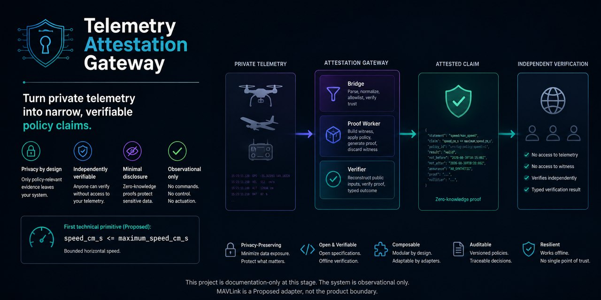

# Telemetry Attestation Gateway

<p align="center">
  
</p>

<p align="center"><em>Conceptual illustration of the Proposed architecture. Documentation-only; not implementation, proof, verification, telemetry-truth, safety, compliance, or production-readiness evidence.</em></p>

> **Current maturity: documentation plus a permitted disposable sandbox track.** No sandbox artifact is a supported prototype, validated capability, MVP component, or deployment.

Telemetry Attestation Gateway is a proposed observational gateway that turns selected telemetry into narrowly defined, privacy-preserving claims. Its first adapter uses MAVLink, and its initial claim is that a simulated vehicle's horizontal speed is at or below a policy limit, without disclosing exact position.

Zero-knowledge proofs can limit disclosure; they do not prove that telemetry reflects physical reality. Chain inclusion does not authenticate an off-chain sensor reading. Source authentication, replay controls, trustworthy time, and vehicle integrity remain separate concerns.

## Product positioning

The Telemetry Attestation Gateway repository is positioned as a **privacy-preserving telemetry attestation gateway**: the proposed system accepts eligible telemetry, preserves and evaluates its declared trust context, and produces narrowly scoped evidence that a private telemetry value satisfies a public policy without publishing the underlying sensitive data. MAVLink is the first telemetry adapter, not the product boundary, and bounded speed is the first claim type, not a commitment to a single-purpose proof system. This human-readable display name is not a commercial product brand; that brand remains undecided pending discovery.

A ledger, when used, is an optional publication or timestamp boundary for approved proof metadata. It is not the source of truth for telemetry, vehicle state, or proof validity; verification and the explicitly modeled source-trust boundary remain authoritative for those questions.

The product is **not**:

- a MAVLink router or general protocol-forwarding service;
- a telemetry archive, flight-log store, or historical analytics platform;
- a flight controller or other navigation and vehicle-control component;
- a command-authority system or a mechanism for approving, issuing, or relaying commands;
- an anonymous tracking service for vehicles, operators, or missions; or
- a general-purpose blockchain bridge for arbitrary messages, assets, or cross-chain activity.

The human-readable repository name is **Telemetry Attestation Gateway**; its hosted-repository identifier remains `telemetry-attestation-gateway`. A commercial product brand has not been selected and remains pending discovery, so neither form may be presented as an approved commercial brand.

## Proposed MVP target

The deterministic, single-vehicle SITL vertical slice below is the eventual proposed MVP target. It becomes an MVP only through [Gate D](docs/delivery-plan.md#gate-d--declare-the-mvp); safe synthetic exploration does not imply that declaration or authorize deployment.

The Current operating state is solo concept work across parallel tracks. The former `M1`–`M11` sequence is superseded and does not block unrelated exploration. The [Current work authorization](docs/current-work-authorization.md) permits documentation work, bounded recruitment outreach, and synthetic reversible work within the [exploration boundary](docs/delivery-plan.md#exploration-boundary). The maintainer may create disposable synthetic-only encoding, parser, mock-adapter, non-cryptographic, proof-feasibility, toy-circuit/local-verification, no-hardware/no-command SITL, and local UI/CLI experiments. Every artifact and output must display **`EXPERIMENTAL`**, **`SYNTHETIC_ONLY`**, and **`NOT VALIDATION OR PRODUCTION AUTHORIZATION`** and remain isolated from real telemetry, ledgers, hardware, credentials, participant data, and production infrastructure. Independent review and external evidence gate promotion and external claims—not sandbox creation. The [delivery plan](docs/delivery-plan.md#synchronization-gates) defines separate gates for supported prototypes, external-discovery evidence, MVP components, and pilot/production components.

1. ingest MAVLink 2 traffic over local UDP and preserve its trust state;
2. normalize the required `GLOBAL_POSITION_INT` and `VFR_HUD` fields;
3. create and independently verify one bounded-speed proof;
4. record approved proof metadata through a deterministic mock chain adapter;
5. show redacted lifecycle state; and
6. replay the scenario in CI from synthetic fixtures.

This MVP is observational. It has no vehicle command path and makes no flight-control, collision-avoidance, safety-critical, scalability, availability, or real-time claim.

## Proposed architecture

```text
single SITL vehicle -> MAVLink bridge -> proof worker -> verifier
                            |                              |
                            +------ redacted status ------+-> mock chain adapter
```

Components are proposed boundaries, not deployed services. Development begins with a modular process or small workspace; external SDKs remain behind adapters. Technology candidates require evidence and an accepted architecture decision record (ADR) before becoming settled choices.

## Start here

The [documentation index](docs/README.md) provides audience-specific reading paths and explains document authority. Read the [Current work authorization](docs/current-work-authorization.md) before contributing. The [delivery plan](docs/delivery-plan.md) owns parallel tracks, artifact dependencies, and promotion gates. The [artifact register](docs/management/validated-claim-contract-register.csv) records independent exploration, provisionality, external-validation, and deployment-approval statuses. Those statuses do not imply that a supported prototype has been implemented.

Choose the shortest path for your reason for visiting:

| Audience | Start with | Then read |
| --- | --- | --- |
| First-time visitor or contributor | [Current work authorization](docs/current-work-authorization.md) | [Product scope](docs/product-scope.md), [architecture](docs/architecture.md), and [delivery plan](docs/delivery-plan.md) |
| Potential customer, partner, or other third party | [Product scope](docs/product-scope.md) | [Commercial model](docs/commercial-model.md), [claim envelope](docs/claim-envelope.md), and [security and privacy](docs/security-and-privacy.md) |
| Manager or decision maker | [Current work authorization](docs/current-work-authorization.md) | [Delivery plan](docs/delivery-plan.md), [management coordination](docs/management/README.md), and [decision register](docs/decisions.md) |
| Engineer or technical reviewer | [Current work authorization](docs/current-work-authorization.md) | [Architecture](docs/architecture.md), [data and proof model](docs/data-and-proof-model.md), [claim envelope](docs/claim-envelope.md), and [testing and operations](docs/testing-and-operations.md) |
| Product or discovery researcher | [Current work authorization](docs/current-work-authorization.md) | [Discovery research plan](docs/discovery-research-plan.md), [product scope](docs/product-scope.md), [commercial model](docs/commercial-model.md), and [decision register](docs/decisions.md) |

### Document directory

- [current work authorization](docs/current-work-authorization.md) — the conservative work boundary for solo-concept M1 and the transition into later work;
- [product scope](docs/product-scope.md) — MVP, deferred work, non-goals, and success measures;
- [architecture](docs/architecture.md) — boundaries, responsibilities, data flow, and failure behavior;
- [data and proof model](docs/data-and-proof-model.md) — telemetry units, encoding, and proof semantics;
- [claim envelope](docs/claim-envelope.md) — public wire contract, disclosure rules, and verifier outcomes;
- [security and privacy](docs/security-and-privacy.md) — trust assumptions, threats, controls, and safety boundary;
- [delivery plan](docs/delivery-plan.md) — parallel tracks, artifact dependencies, evidence, owners, and promotion gates;
- [testing and operations](docs/testing-and-operations.md) — validation layers and readiness gates; and
- [commercial model](docs/commercial-model.md) — open capabilities, optional services, and anti-lock-in rules;
- [discovery research plan](docs/discovery-research-plan.md) — research protocol, privacy gate, and evidence rules;
- [decision register](docs/decisions.md) — proposed, open, deferred, and accepted decisions; and
- [management coordination](docs/management/README.md) — operational work-item status and external-tool mapping.

## Contributing during discovery

During the Current solo-concept M1 state, useful contributions include documentation work and compliant disposable experiments permitted by the [Current work authorization](docs/current-work-authorization.md). Do not describe sandbox behavior as implemented product capability, use it for discovery, or promote it into supported prototype, MVP, pilot, or production work without the destination evidence required by the delivery plan.

## Safety and license

Sandbox simulation is permitted only with demonstrably synthetic inputs, no hardware, and no command path. Do not connect an experimental build to a live ledger, production infrastructure, or flight-critical command path. Hardware and operational work require the gates in the [delivery plan](docs/delivery-plan.md).

The root [MIT License](LICENSE) remains the current effective license. A layered MPL-2.0/CC-BY-4.0/CC0-1.0 model is [Proposed, not approved or implemented](LICENSING.md), pending legal, community-impact, dependency, ownership, and ADR review. Contributors must follow the [DCO and provenance policy](CONTRIBUTING.md).
